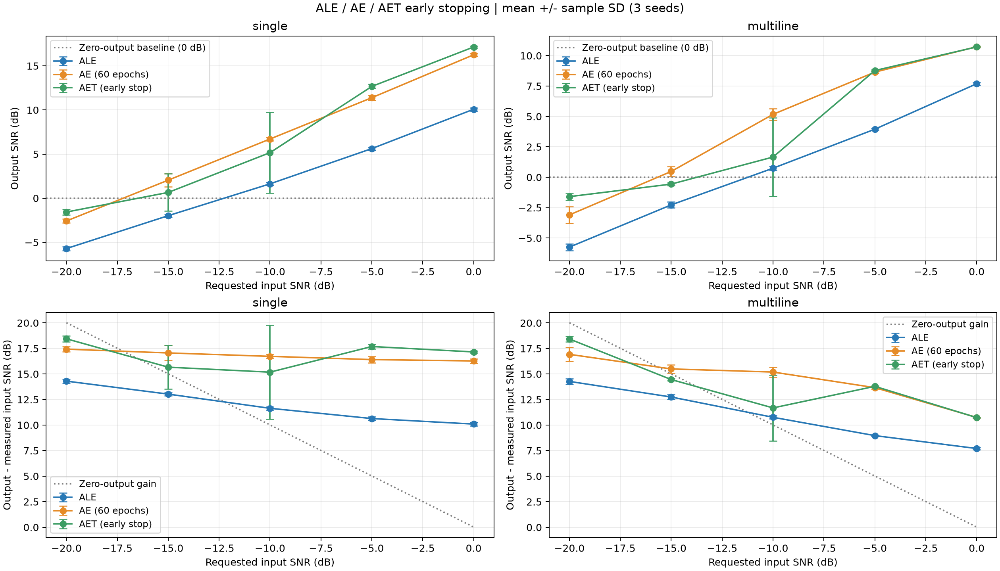
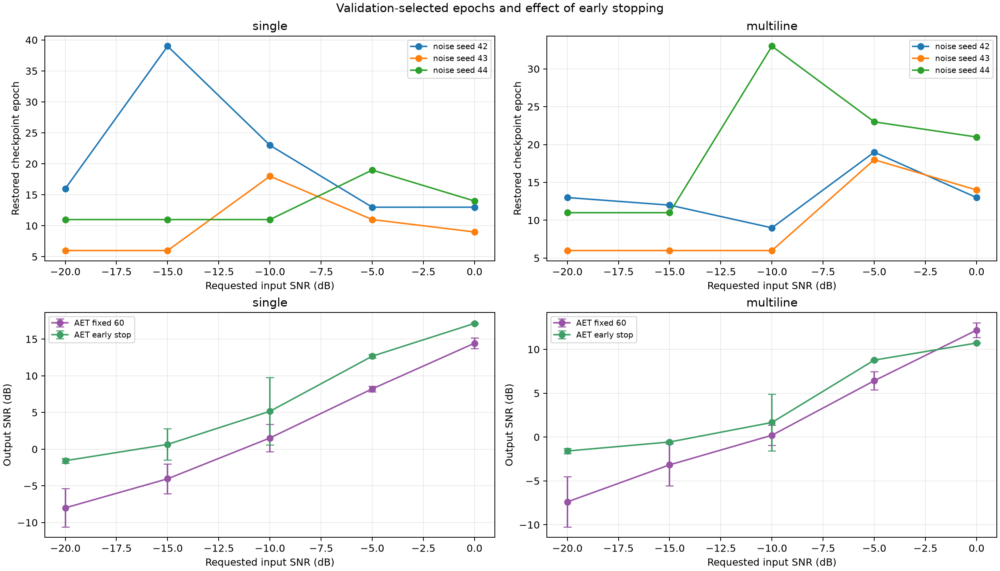
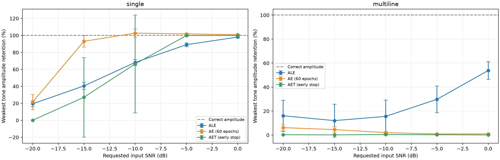

# AET 独立带噪验证早停：ALE / AE / AET 对比

日期：2026-10-07。以下数值来自实际运行；早停规则在计算最终干净参考指标之前确定。

## 实验与早停机制

- 原项目没有内置早停。本次在实验脚本中实现验证、停止和最佳权重恢复，网络、Adam、洗牌顺序与原 AET 保持一致。
- 输入 SNR=[-20, -15, -10, -5, 0] dB，噪声种子=[42, 43, 44]、模型种子依次为 0/1/2；单谱线 100 Hz，多谱线 50/100/180 Hz、幅度 1/0.6/0.3。
- 原观测 16000 点、1 kHz，沿用之前原始数据。ALE/AE 直接复用并重算之前输出，AE 固定 60 轮；只对 AET 更换停止机制。
- AET 最多 120 轮，每轮完成后验证。验证 MSE 必须相对已保存最佳值下降超过 0.01% 才算改善；连续 10 轮无此改善则停止，恢复上一次明显改善的检查点。没有达到 patience 时用预算内最佳检查点。
- 每段观测另生成 3 个独立噪声重复观测：seed = 原 noise_seed + 10000 × (1..3)。共享同一合成潜在信号，噪声为独立 IID 高斯，标准差取原噪声 RMS；不按样本功率二次缩放。
- 验证集完全不参与优化，归一化只在原训练观测上拟合。验证输入按推理规则裁剪到 [0,1]，带噪目标不裁剪；归一化帧 MSE 跨全部验证对求平均。
- 延迟 1000 点大于序列覆盖 768 点，因此单个验证输入/目标的噪声采样不重叠。早停函数只接收训练带噪观测、验证带噪观测和配置，不接收干净标签、频率或最终 SNR。
- 干净信号用于合成重复观测与最终外部评价，不用于早停损失或选轮次；这是具有重复观测的合成实验条件。现实只有一条观测时，不能凭空得到这组验证数据。
- 统一评价区间 [8000,14976)，输出 SNR=10log10(mean(clean²)/mean((output-clean)²))；增益相对于该区间实测输入 SNR。误差条为 3 次重复的样本标准差，不是置信区间。

## 三算法输出 SNR（均值 ± 标准差，dB）

| 场景 | 输入 SNR | ALE | AE（60 轮） | AET（验证早停） |
|---|---:|---:|---:|---:|
| single | -20 | -5.716 ± 0.223 | -2.588 ± 0.220 | -1.573 ± 0.314 |
| single | -15 | -1.986 ± 0.175 | 2.043 ± 0.737 | 0.650 ± 2.121 |
| single | -10 | 1.624 ± 0.167 | 6.709 ± 0.216 | 5.162 ± 4.597 |
| single | -5 | 5.622 ± 0.173 | 11.393 ± 0.304 | 12.672 ± 0.246 |
| single | 0 | 10.082 ± 0.181 | 16.258 ± 0.195 | 17.142 ± 0.091 |
| multiline | -20 | -5.743 ± 0.282 | -3.095 ± 0.673 | -1.592 ± 0.301 |
| multiline | -15 | -2.271 ± 0.247 | 0.478 ± 0.418 | -0.563 ± 0.123 |
| multiline | -10 | 0.744 ± 0.169 | 5.173 ± 0.471 | 1.663 ± 3.240 |
| multiline | -5 | 3.952 ± 0.070 | 8.646 ± 0.101 | 8.774 ± 0.070 |
| multiline | 0 | 7.689 ± 0.109 | 10.731 ± 0.028 | 10.718 ± 0.060 |



## seed=42、输入 −20 dB

| 场景 | 算法 | 选中轮次 | 实际停止轮次 | 输出 SNR | SNR 增益 | 最强 / 最弱谱线幅值保留 |
|---|---|---:|---:|---:|---:|---:|
| single | ALE | 0 | 0 | -5.647 | 14.381 | 23.245% / 23.245% |
| single | AE | 60 | 60 | -2.470 | 17.558 | 11.546% / 11.546% |
| single | AET_ES | 16 | 26 | -1.541 | 18.487 | 0.172% / 0.172% |
| multiline | ALE | 0 | 0 | -5.687 | 14.343 | 12.479% / 30.778% |
| multiline | AE | 60 | 60 | -2.318 | 17.712 | 6.140% / 8.820% |
| multiline | AET_ES | 13 | 23 | -1.609 | 18.421 | 0.075% / 0.260% |

## AET：固定 60 轮与早停

| 场景 | 输入 SNR | 早停相对 60 轮变化（均值 dB） | 三个种子选中轮次 | 三个种子停止轮次 |
|---|---:|---:|---|---|
| single | -20 | +6.423 | [16, 6, 11] | [26, 16, 21] |
| single | -15 | +4.687 | [39, 6, 11] | [49, 16, 21] |
| single | -10 | +3.636 | [23, 18, 11] | [33, 28, 21] |
| single | -5 | +4.453 | [13, 11, 19] | [23, 21, 29] |
| single | 0 | +2.701 | [13, 9, 14] | [23, 19, 24] |
| multiline | -20 | +5.800 | [13, 6, 11] | [23, 16, 21] |
| multiline | -15 | +2.604 | [12, 6, 11] | [22, 16, 21] |
| multiline | -10 | +1.458 | [9, 6, 33] | [19, 16, 43] |
| multiline | -5 | +2.353 | [19, 18, 23] | [29, 28, 33] |
| multiline | 0 | -1.470 | [13, 14, 21] | [23, 24, 31] |



## 如何解读

本次 30 个观测中，25 个的早停输出 SNR 高于原 AET 固定 60 轮；按场景与输入 SNR 汇总，10 个条件中 9 个均值改善。单谱线 −5/0 dB 时，AET 早停平均输出 SNR 为 12.672/17.142 dB，超过当前固定 60 轮 AE 的 11.393/16.258 dB。单谱线 −15/−10 dB 和多谱线 −15/−10 dB 时，AE 平均输出 SNR 仍更高；−10 dB 的 AET 重复实验波动较大，说明选轮次与学习过程对种子敏感。

**主要代价是弱谱线丢失。** 多谱线 0 dB 的 AET 平均输出 SNR 从固定 60 轮的 12.188 dB 降至早停的 10.718 dB；180 Hz 弱线平均幅值保留从 **84.652% 降至 0.129%**。其他多谱线条件下，早停弱线保留也都低于 0.5%。因此，即使整体 SNR 改善，也不能说早停提升了多谱线恢复能力。

这组对比支持如下解释：较早检查点减少了谱线外误差，但弱谱线尚未充分学到；当前 patience=10 可能在学习平台期就终止训练。验证目标是所有帧的平均误差，强谱线和噪声对该指标的贡献可以掩盖弱谱线的学习收益。较早模型与 60 轮模型的差异是实测证据；“平台期后继续训练能否改善验证指标”及更合适的 patience 尚未验证，不将其作为已经确定的结论。

对此前关注的 seed=42、−20 dB：单谱线选中第 16 轮、在第 26 轮触发停止；多谱线选中第 13 轮、在第 23 轮触发停止。选中轮次与实际停止轮次不同，是因为停止前还需等待 10 轮，再恢复此前权重。单谱线最强线只保留 0.172%，多谱线最强/最弱线只保留 0.075%/0.260%；这里的 SNR 优势主要伴随输出信号被压低，不能作为恢复成功的证据。

早停限制了模型继续降低训练误差时对特定噪声的拟合，但不保证学到有效谱线。必须同时看输出 SNR、谱线幅值保留与波形；尤其在 −20 dB，输出全为零就有 0 dB 输出 SNR、约 20 dB 增益，不能仅凭增益宣称成功恢复。图中加入全零基线用于识别这个现象。

此前逐轮实验的单谱线 16 轮、多谱线 5 轮，是用干净参考 SNR 事后选出的峰值。本次独立带噪验证早停可选择不同轮次，不能把之前峰值直接作为所有 SNR 的固定停止规则。

验证 MSE 与实际同段增强的 SNR 不完全相同：验证包含额外噪声、帧重叠加权，最终输出还做重叠平均；有限样本与耐心参数也影响选轮次。因此早停并非每个条件都提高 SNR。本次没有用最终测试指标反复调 patience 或阈值。

本对比回答“把现有 AET 改为验证早停后效果如何”。AET 有额外验证观测，AE 固定 60 轮；模型容量、训练预算和可用验证信息不同，不能解释为三种架构最优调参后的公平排名。三个种子不足以推广成普遍结论。



## 交付与复跑

- `snr_comparison.png/.svg`：两场景三算法输出 SNR 与增益。
- `seed42_snr_comparison.png`：seed=42 的三算法扫描对比。
- `early_stopping_effect.png`：停止轮次和 AET 固定 60 轮前后效果。
- `weakest_tone_retention.png`：弱谱线幅值保留。另有 seed=42 波形、频谱和共享色标时频图。
- `metrics.csv` / `summary.csv` / `early_stopping_selections.csv`：逐观测、汇总指标和轮次。
- 每个 `cases/` 子目录：完整输出信号、独立验证观测、逐轮验证日志、早停检查点和选择依据。
- `manifest.json` 保存协议与来源哈希，`validation.json` 保存重算和检查点一致性检查。

核验结果：30 个案例、90 条算法指标和 30 条汇总指标均重算通过；全部早停决策按保存的验证损失重放一致，30 个检查点的验证损失与保存值差异为 0，原始 ALE/AE 输出未改变。10 张 PNG 已检查可读，主图和谱线图已目视检查。停止、最佳权重恢复以及首轮与原训练函数完全一致也通过小规模运行核对。

```powershell
.\.venv\Scripts\python.exe scripts/compare_aet_early_stopping.py --resume
.\.venv\Scripts\python.exe scripts/validate_aet_early_stopping.py
```
