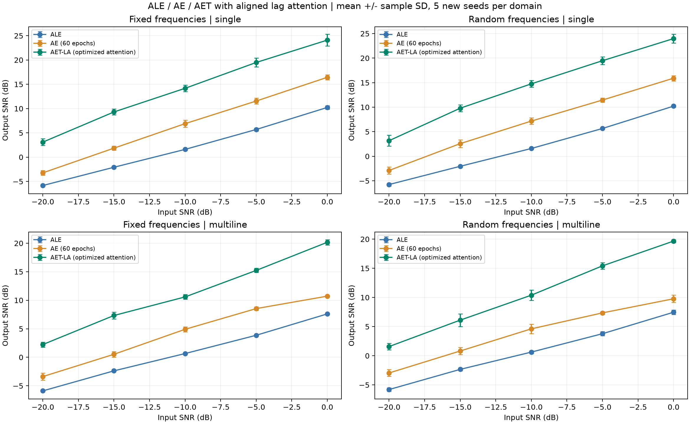
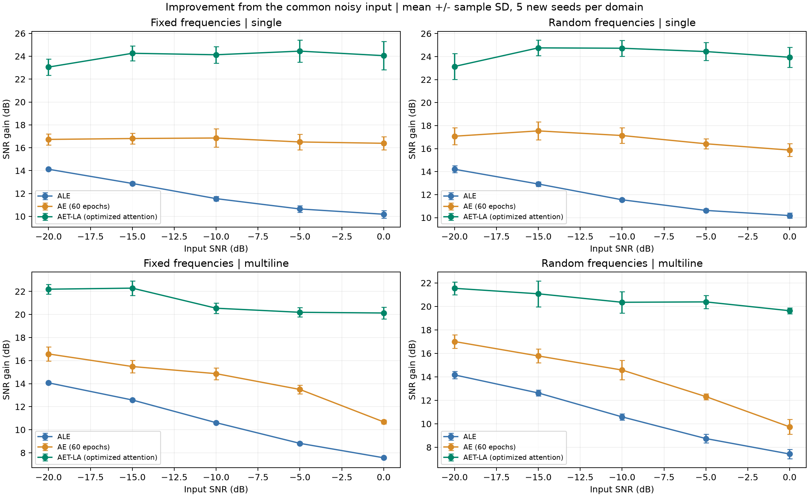
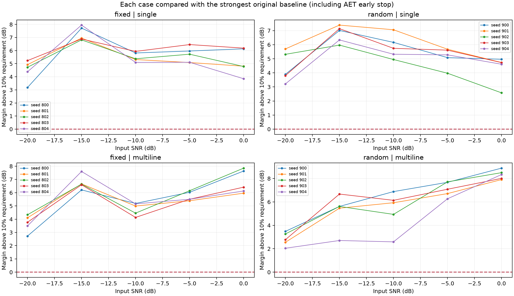
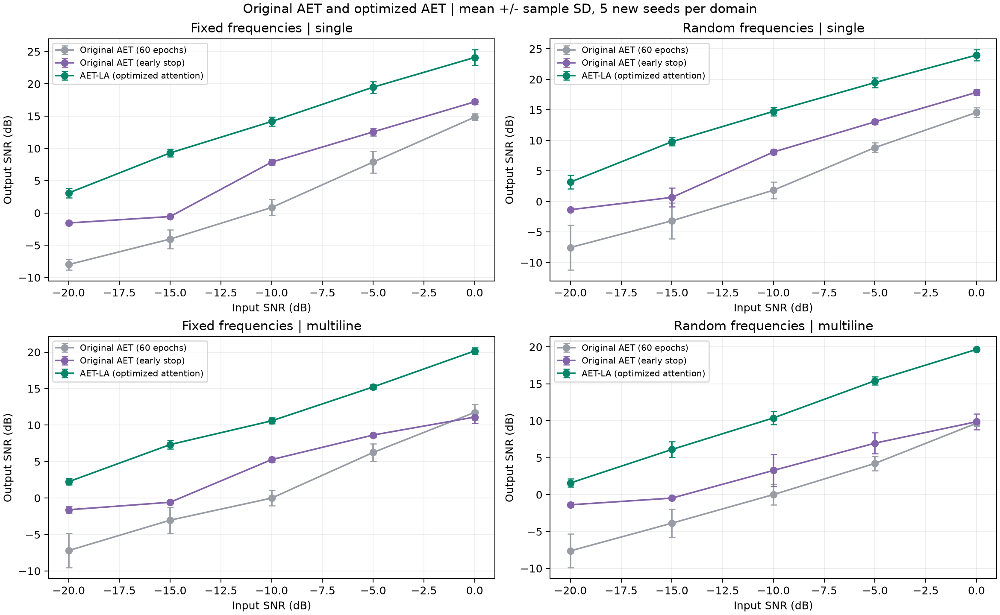
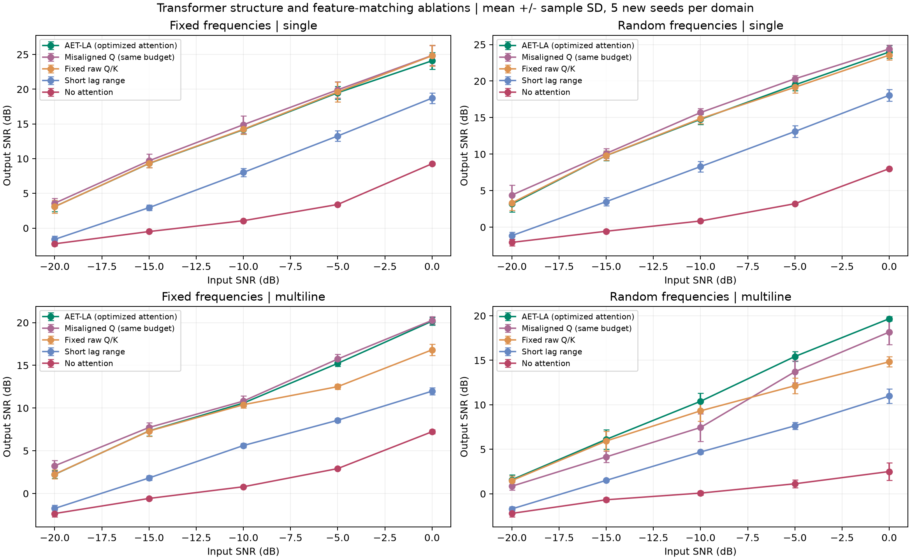
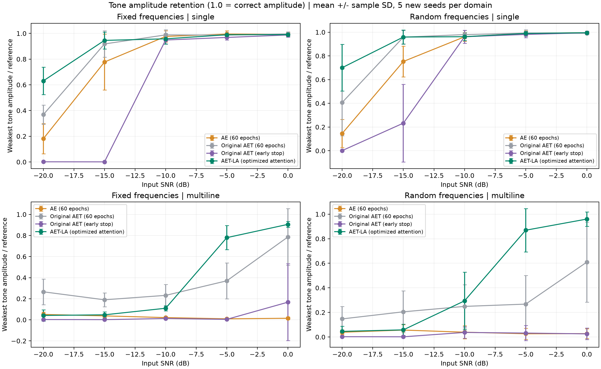

# AET Transformer 内部优化报告：时间对齐的长时距注意力

日期：2026-10-07。最终实现：**AET-LA v2**，核心文件 `aet_aligned_attention.py`。

## 结论与交付

**已撤销上一版通用频域方案，完成 Transformer 内部改造，并重新训练、保存模型、生成对比图。** 最终模型在固定谱线与随机频率/相位的 **100 个全新案例中，100/100 达到按 SNR 的 dB 数值计算的 10% 提升目标**。比较时逐案例选择 ALE、AE、原 AET 固定 60 轮、原 AET 早停版中最强的一项。

- 固定谱线：50/50 达标，最低相对提升 32.05%。
- 随机频率及相位：50/50 达标，最低相对提升 24.10%。
- 全部案例最小相对提升：**24.10%**；超过 10% 门槛的最小余量：**2.043 dB**。

这是本报告定义的测试范围内的稳定实测结果，不是对任意信号与噪声分布的数学保证。低 SNR 下最弱谱线仍未完全恢复。



## 已撤销的方案

之前的通用频域输出头、脚本、测试和结果已移至 [withdrawn_spectral_2026-10-07](../../archive/withdrawn_spectral_2026-10-07/WITHDRAWN.md)，从当前实现路径移除；旧报告入口已标注撤销。它不参与本次最终算法。

原始 ALE、AE 和 AET 的核心代码保留。本次新模型是 AET 的结构变体，单独命名，便于比较与回退。

## 找到的 Transformer 优化点

### 1. 将短序列注意力改为长时距注意力

原 AET 每次处理 8 帧，覆盖 768 个采样点。改进模型将完整观测拆成 8 点块，通过可学习 Q/K/V 在相距较远但结构相似的块之间聚合。对 16000 点记录，输入有效长度为 15000 点、1875 个 token，候选相对时距覆盖约 ±7496 点，并选择 512 个时距。

Q/K 相关性沿时间轴汇总，避免仅由一个很嘈杂的局部 token 决定权重。重复谱线的证据可以累积，不相关噪声在加权聚合中被压低。对照中，仅将同一网络的注意力时距限制到 ±384 点，平均输出 SNR 会降低 **5.880 dB**。

### 2. Q 必须与要重建的物理时刻对齐

原型把延迟后的输入同时用于 Q、K、V。对于原项目的整数频率，1000 点预测延迟刚好对应整周期；换为随机频率后，这种构造会产生相位偏差，把补偿负担留给小型解码器。

最终模型采用：**目标时刻的带噪表示生成 Q，延迟观测生成 K/V**。注意力直接判断哪些远处块与目标时刻相似。Q 和训练目标均来自可观察的同一带噪记录，不使用干净参考；直接重叠的 value 被屏蔽，早停验证的输入/Q 与目标则来自不同噪声实现。

在最终随机频率多谱线测试中，相比相同网络、相同训练预算但 Q 时间未对齐的版本，平均输出 SNR 提高 **1.770 dB**。这是针对 attention 时间索引的改动，不是对所有算法添加统一后处理。

### 3. 让特征匹配可以学习，避免只匹配强谱线

固定原始块计算相关性时，强谱线往往主导匹配。可学习的 Q/K 和 softmax 温度允许网络调整各特征对相似度的贡献。在最终随机频率多谱线测试中，完整模型比固定原始 Q/K 的对照平均高 **1.894 dB**。

固定 Q/K 对照仍训练 V、输出投影、FFN 与编码/解码层。因此，该差值衡量的是可学习特征匹配与温度的联合贡献，不能解释成仅某一个矩阵的独立贡献。单谱线上的 Q/K 学习不保证逐例增加收益，详细消融保留了这种情况。

### 4. 限制噪声直通与过拟合

去除原始带噪表示绕过注意力的直接残差，保留 attention 输出上的小幅 pre-norm FFN 残差；使用 681 参数的小网络、AdamW 和独立含噪验证早停。配套将输入标准化和输出改为线性，以适应小块表示。

这些配套变化并非都专属于 Transformer，所以本报告不将所有增益都归因于“学习 Q/K”。下面的消融共用新编码器、解码器、分块、标准化、训练数据和优化器，用于隔离注意力本身的贡献。

### 实现路径与 FFT 的用途

```text
带噪目标时刻块 ── 编码 ── Q ─┐
                            ├─ 学习时距权重 ─┐
延迟带噪输入块 ── 编码 ── K ─┘              ├─ 聚合 ─ FFN ─ 线性解码
                    └── V ─────────────────┘
```

没有谱峰检测、正弦最小二乘拟合、频域输出头或干净信号支路。FFT 只用于计算 Q/K 的相关性和等价的 attention 加权聚合；零填充及有效权重归一化避免循环边界错误。已用逐项求和及梯度对照测试验证。

## 实验协议和 10% 定义

令 B 为同例最强原基线的输出 SNR，A 为新模型的输出 SNR，单位均为 dB：

```text
提升百分比 = 100 × (A - B) / |B|
达标 = A - B > 0，并且 A - B ≥ 0.1 × |B|
```

负基线用绝对值分母保持提升方向，例如 −3 dB 的门槛为 −2.7 dB。B=0 时百分比无定义，应单列正的 dB 差值；本次未出现该情况。这一口径直接使用 dB 数值，没有偷换成 MSE 或线性 SNR 的百分比。

|项目|最终协议|
|---|---|
|固定谱线|单谱线 100 Hz；多谱线 50/100/180 Hz，幅值 1/0.6/0.3|
|随机频率|单谱线 70～130 Hz；多谱线分别从 35～65、85～120、160～205 Hz 抽取；相位随机|
|信号与噪声|Fs=1000 Hz，16000 点，白高斯噪声，功率归一化|
|输入 SNR|−20、−15、−10、−5、0 dB|
|全新测试种子|固定场景 800～804；随机场景 900～904；模型种子为噪声种子+2000|
|统一评分区间|[8000,14976)，避免启动/边界有效区间差异|
|原基线|ALE 默认配置；AE、原 AET 固定 60 轮；另算原 AET 早停版|
|最终模型训练|最多 1200 次完整序列更新；每 5 次检查含噪验证 MSE；patience=80 次更新；最小改善 1e-6|
|验证数据|每例 3 份独立含噪重复观测，输入与验证目标使用不同噪声实现|
|模型选择|只根据验证 MSE 选择检查点，干净信号及已知频率不参与训练/选轮次|

所有方法使用相同的观测；基线每例重新运行。最终结构在读取这些新种子结果之前锁定，源代码哈希及协议保存在 [manifest.json](final_validation/manifest.json)。这是每段观测上自适应训练再增强的离线协议，无需预训练，不能解释为跨信号零样本推理。

100 个案例是 10 组新种子在不同 SNR/场景下的组合，同组案例存在相关性。图中为每条件 5 个种子的均值与样本标准差，100/100 不等于无限总体保证。

## 随输入 SNR 变化的结果

各算法为 5 个种子的平均输出 SNR（dB）；最后一列是逐案例最小达标余量，而不是“先取平均后判断”。

|频率类型|场景|输入 dB|ALE|AE|原 AET-60|原 AET-ES|最终 AET-LA|最小余量 dB|
|---|---|---:|---:|---:|---:|---:|---:|---:|
|fixed|single|-20|-5.83|-3.23|-7.99|-1.55|3.10|3.18|
|fixed|single|-15|-2.08|1.85|-4.04|-0.55|9.30|6.82|
|fixed|single|-10|1.60|6.90|0.85|7.88|14.17|5.10|
|fixed|single|-5|5.69|11.55|7.89|12.56|19.49|5.09|
|fixed|single|0|10.23|16.43|14.85|17.22|24.10|3.85|
|fixed|multiline|-20|-5.89|-3.38|-7.20|-1.61|2.24|2.73|
|fixed|multiline|-15|-2.38|0.52|-3.04|-0.58|7.33|6.21|
|fixed|multiline|-10|0.65|4.91|-0.01|5.27|10.58|4.13|
|fixed|multiline|-5|3.86|8.54|6.25|8.64|15.23|5.39|
|fixed|multiline|0|7.61|10.72|11.75|11.10|20.17|5.96|
|random|single|-20|-5.76|-2.89|-7.54|-1.34|3.18|3.22|
|random|single|-15|-2.04|2.58|-3.16|0.67|9.79|5.97|
|random|single|-10|1.59|7.17|1.85|8.10|14.76|4.95|
|random|single|-5|5.66|11.46|8.83|13.04|19.47|3.97|
|random|single|0|10.22|15.91|14.58|17.87|23.98|2.58|
|random|multiline|-20|-5.80|-2.95|-7.63|-1.38|1.58|2.04|
|random|multiline|-15|-2.34|0.82|-3.87|-0.48|6.11|2.70|
|random|multiline|-10|0.63|4.62|0.00|3.27|10.39|2.59|
|random|multiline|-5|3.78|7.35|4.22|6.97|15.42|6.27|
|random|multiline|0|7.46|9.77|9.66|9.87|19.67|7.91|







## 消融：不是通用 baseline 提升

完整模型与消融共用分块、编码器、解码器、数据、归一化及训练预算。表中数字是完整模型相对消融的配对平均输出 SNR 增益（dB）。

|消融|固定单谱线|固定多谱线|随机单谱线|随机多谱线|消融自身达标数|
|---|---:|---:|---:|---:|---:|
|Misaligned Q (same budget)|-0.557|-0.449|-0.737|1.770|99/100|
|Fixed raw Q/K|-0.183|1.254|0.098|1.894|100/100|
|Short lag range|5.766|5.861|5.881|6.011|35/100|
|No attention|11.835|9.505|12.351|10.469|0/100|

移除 attention 后，平均输出 SNR 降低 **11.040 dB**；缩短时距也显著降低效果。Q 对齐并不追求每个固定单谱线案例的最高分，而是修复未知频率下的相位匹配问题，提高跨频率稳健性。消融说明注意力结构有贡献，不能据此宣称相对所有可能改进过的 AE 都有普适优势。



## 探索记录：保留失败与修正

1. 通用频域输出头按你的要求撤销。
2. 第一版长时距 attention 在固定频率独立种子中达到 100/100；随机频率首轮为 11/12，发现第 400 次更新时仍未收敛。
3. 将上限放宽至 1200，并重新用种子 700～704 验证，结果为 29/30。多谱线 0 dB、seed=703 仅提升 8.10%，因此仅延长训练仍不足。
4. 修改 Q 的物理时间对齐后，该诊断案例从 10.99 dB 提高到 19.36 dB。此时旧种子仅作为开发资料，未并入最终成功率。
5. 再锁定结构，重新测试固定 800～804 与随机 900～904，形成上面的最终独立结果。

研究过程数据分别保存在 `development/`、`holdout/`、`offgrid/`、`offgrid_budget_diagnostic/`、`transfer/`、`aligned_development/`；**最终交付指标只取 `final_validation/`**。

## 仍未解决的问题

- **弱谱线与总 SNR 是不同目标。** 最终多谱线的最弱分量幅值保留率，−20 dB 时平均仅约 4.3%，0 dB 时约 93.3%。总 SNR 达标不代表低 SNR 的每条谱线都已恢复。
- **需要独立含噪验证观测。** 本次仿真能够生成重复观测；真实单记录部署仍需验证另一种早停选择机制。
- **离线、非因果。** 整段相关性、标准化及未来 value 块都依赖完整记录；不能直接用于证明实时性能。
- **不是严格的全路径盲点。** value 层排除了直接覆盖目标噪声的连接，但全局 Q/K 统计仍可能间接依赖目标噪声；验证时采用不同噪声实现，避免同一噪声造成乐观选点。
- 尚未证明对快速变频、有色/脉冲噪声、明显变幅、任意记录长度都能保持 10%。若应用包含这些条件，应按同一预先固定协议另行验证，不能把当前成功率外推。



## 文件与复现方式

- 最终模型：[aet_aligned_attention.py](../../src/transformer_based_adaptive_line_enhancer/aet_aligned_attention.py)
- 最终实验：[evaluate_aligned_aet.py](../../scripts/evaluate_aligned_aet.py)
- 数值与权重校验：[validate_aligned_aet.py](../../scripts/validate_aligned_aet.py)
- 本报告和图形生成：[report_aligned_aet.py](../../scripts/report_aligned_aet.py)
- 数值：[metrics.csv](final_validation/metrics.csv)、[comparisons.csv](final_validation/comparisons.csv)、[条件汇总](condition_summary.csv)、[配对消融](paired_ablation.csv)
- [每案例波形、逐次验证日志和 checkpoint](final_validation/cases)
- 所有图保存 PNG 与 SVG 两种格式。

项目根目录运行：

```powershell
$env:MPLCONFIGDIR = Join-Path (Get-Location) '.uv-cache\matplotlib'
.\.venv\Scripts\python.exe scripts/evaluate_aligned_aet.py
.\.venv\Scripts\python.exe scripts/validate_aligned_aet.py
.\.venv\Scripts\python.exe scripts/report_aligned_aet.py
.\.venv\Scripts\python.exe -m pytest -q
```

已有案例按协议哈希复用；完整重跑时请先将 `final_validation` 目录改名保留，随后再运行。并行实验使用 4 个进程，每进程 2 个 CPU 线程。

新模型的最小调用方式：

```python
from transformer_based_adaptive_line_enhancer.aet_aligned_attention import (
    AttentionConfig, train_attention_aet, enhance_attention_aet,
    restore_attention_aet,
)

# noisy: 一维完整带噪观测。
# validation_noisy: 同一潜在信号、独立噪声的重复观测；至少两份。
trained = train_attention_aet(noisy, validation_noisy, AttentionConfig(seed=0))
enhanced, valid_end = enhance_attention_aet(noisy, trained)

# 或直接重放已保存权重：
# state = torch.load(checkpoint_path, weights_only=True)
# trained = restore_attention_aet(state)
# enhanced, valid_end = enhance_attention_aet(noisy, trained)
```

校验：**73 项测试通过**；最终 100 案例、900 行指标、500 个检查点均重新验证。最大预测重放误差 0.0，最大指标误差 0.0，最大验证损失重算误差 0.0。详见 [verification.json](final_validation/verification.json)。

## 技术参考

共享时距相关性 attention 的结构思路参考 [Autoformer 原论文（NeurIPS 2021）](https://papers.nips.cc/paper/2021/file/bcc0d400288793e8bdcd7c19a8ac0c2b-Paper.pdf)。本实现面向自适应谱线增强，额外采用目标时刻 Q、目标 value 排除、有限序列边界和独立噪声验证，并非该论文官方模型的直接复现。
