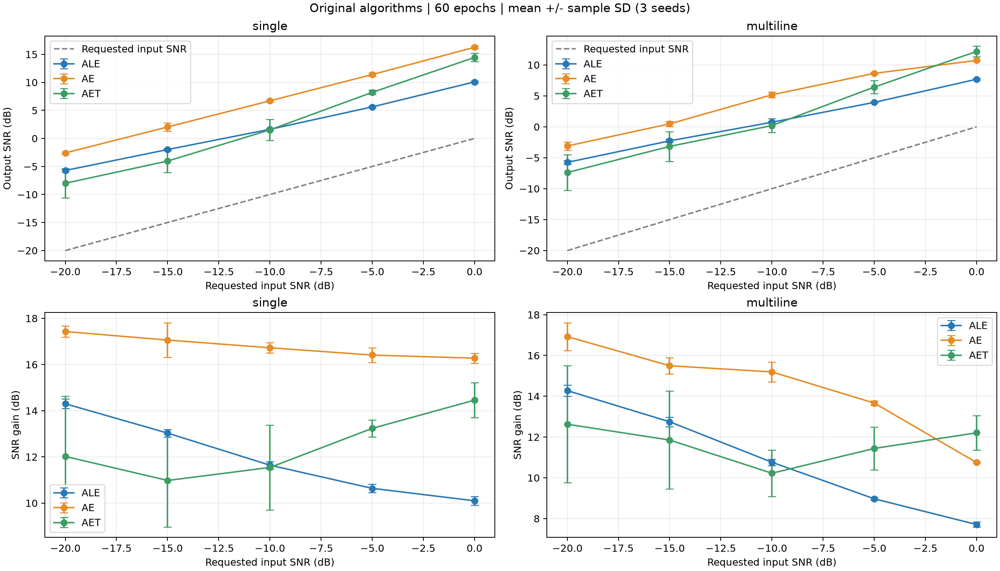
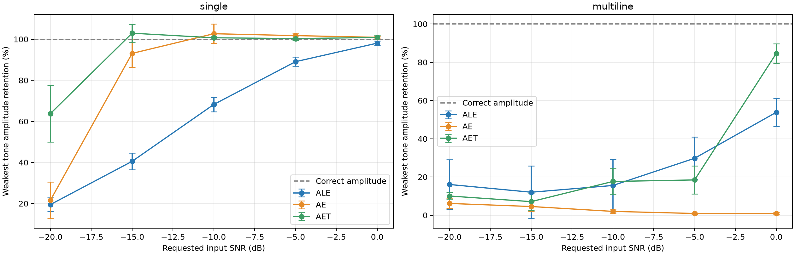
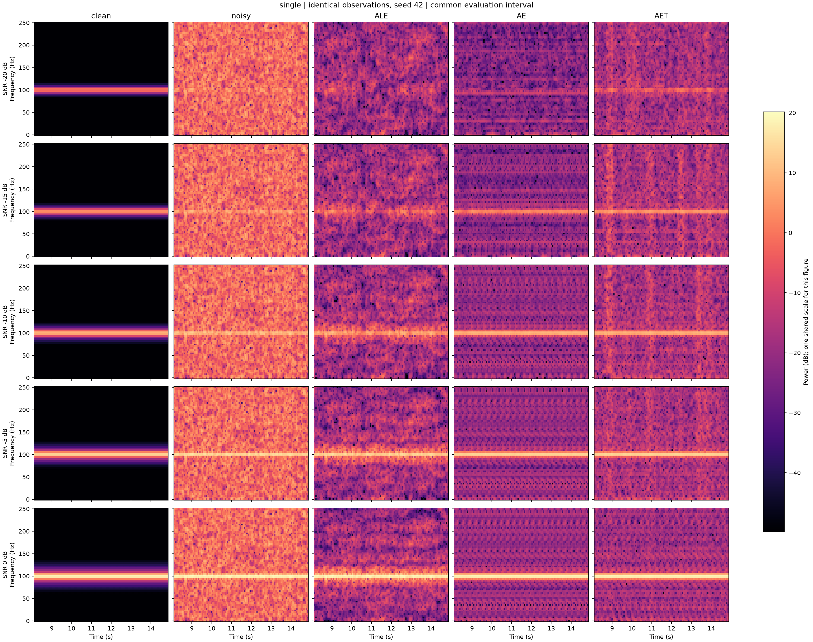
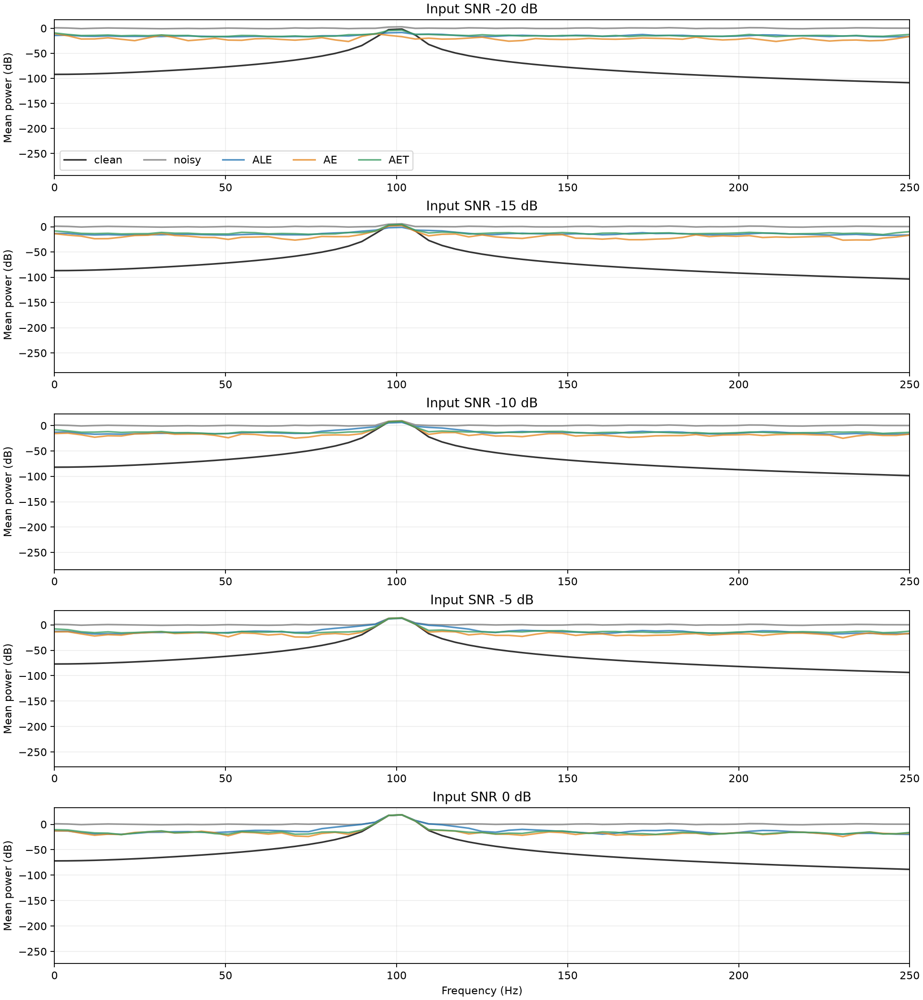
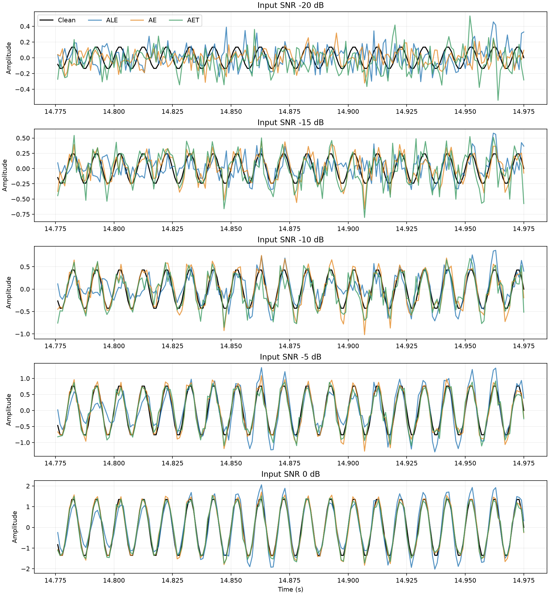
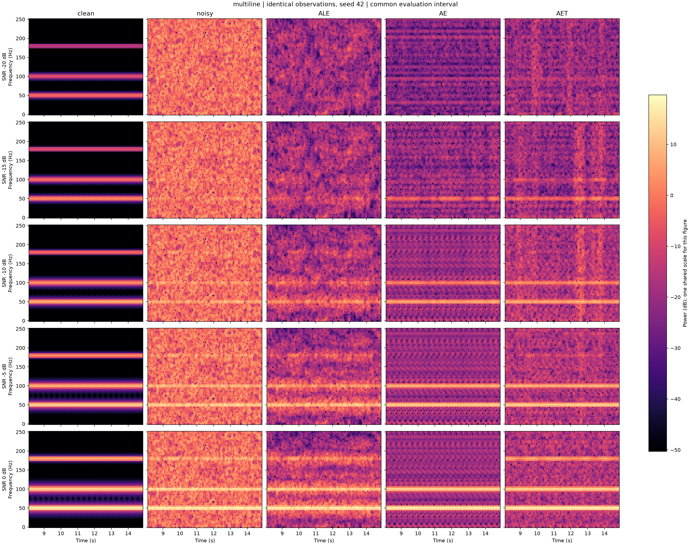
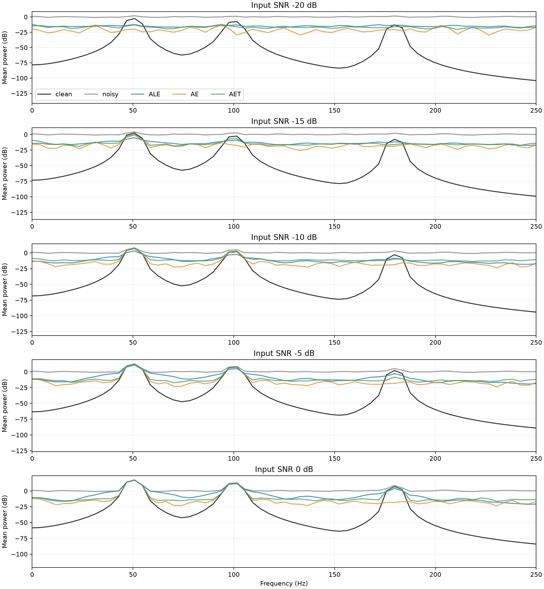
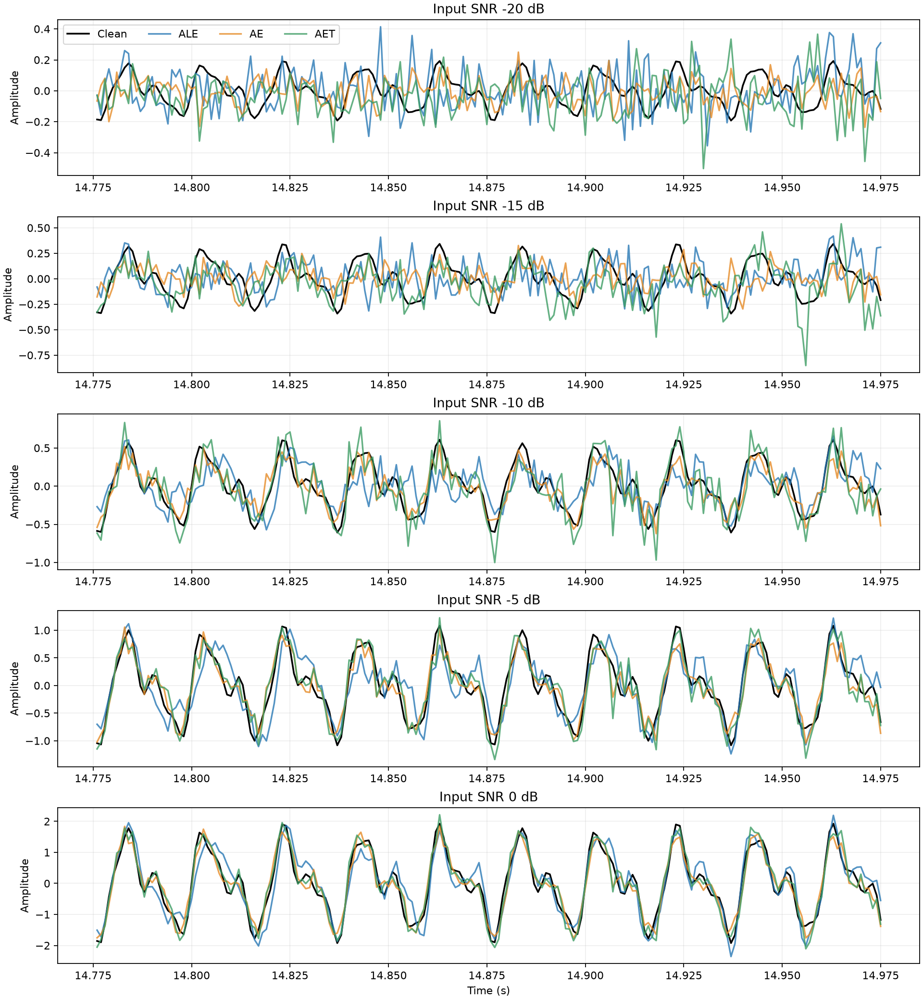
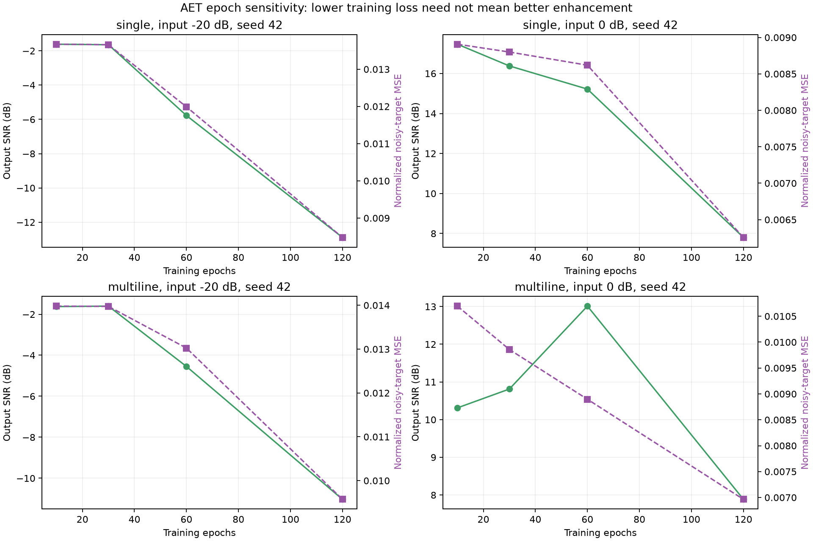

# ALE / AE / AET 随 SNR 变化的复现对比

日期：2026-10-07（Asia/Shanghai）。本报告由实测数据自动生成。

## 实验协议

- Git 基线：`4d8eb295273257a7fb78b718d75db54e27422292`；直接调用原项目三种算法，未修改模型实现。
- 单谱线：100 Hz，幅度 1。多谱线：50/100/180 Hz，幅度 1/0.6/0.3。
- 输入 SNR：[-20, -15, -10, -5, 0] dB；噪声种子：[42, 43, 44]，模型种子依次为 0/1/2（按种子列表索引）。
- 采样率 1 kHz、长度 16,000 点、高斯白噪声、power-normalized 缩放。
- AE/AET 保留原网络默认结构；每段观测从随机初始化训练 60 轮，然后增强同一段观测。
- 所有算法使用完全相同的观测；评价从第 8,000 点开始，取三种算法有效区间交集。
- 延迟 1,000 点，AE 帧长 256，AET 序列覆盖 768 点；单个训练对输入与目标不共享采样点。
- CPU 运行，PyTorch 线程数 2。运行环境见 environment.json。
- SNR = 10 log10(mean(clean²) / mean((output-clean)²))；增益相对于同一评价区间的带噪输入。
- 幅值保留：在已知频率处同时拟合正弦/余弦及常数项，再用输出幅值除以干净参考幅值；频率信息仅用于外部评价。
- 误差棒为种子之间的样本标准差，不是置信区间；3 个种子只反映有限场景波动。

## 输出 SNR（均值 ± 样本标准差，dB）

| 场景 | 请求输入 SNR | ALE | AE | AET |
|---|---:|---:|---:|---:|
| single | -20 | -5.72 ± 0.22 | -2.59 ± 0.22 | -8.00 ± 2.62 |
| single | -15 | -1.99 ± 0.18 | 2.04 ± 0.74 | -4.04 ± 2.02 |
| single | -10 | 1.62 ± 0.17 | 6.71 ± 0.22 | 1.53 ± 1.84 |
| single | -5 | 5.62 ± 0.17 | 11.39 ± 0.30 | 8.22 ± 0.38 |
| single | 0 | 10.08 ± 0.18 | 16.26 ± 0.19 | 14.44 ± 0.74 |
| multiline | -20 | -5.74 ± 0.28 | -3.09 ± 0.67 | -7.39 ± 2.87 |
| multiline | -15 | -2.27 ± 0.25 | 0.48 ± 0.42 | -3.17 ± 2.41 |
| multiline | -10 | 0.74 ± 0.17 | 5.17 ± 0.47 | 0.21 ± 1.14 |
| multiline | -5 | 3.95 ± 0.07 | 8.65 ± 0.10 | 6.42 ± 1.05 |
| multiline | 0 | 7.69 ± 0.11 | 10.73 ± 0.03 | 12.19 ± 0.85 |

## 最弱谱线幅值保留（均值，%）

单谱线为 100 Hz；多谱线为幅度最弱的 180 Hz。100% 表示幅值正确，超过 100% 表示放大，不能一律视为更好。

| 场景 | 请求输入 SNR | ALE | AE | AET |
|---|---:|---:|---:|---:|
| single | -20 | 19.5 | 21.6 | 63.8 |
| single | -15 | 40.5 | 93.1 | 103.0 |
| single | -10 | 68.2 | 102.7 | 100.7 |
| single | -5 | 89.1 | 101.8 | 100.3 |
| single | 0 | 98.1 | 100.9 | 100.9 |
| multiline | -20 | 16.1 | 6.2 | 10.1 |
| multiline | -15 | 12.0 | 4.6 | 7.1 |
| multiline | -10 | 15.6 | 2.0 | 17.7 |
| multiline | -5 | 29.8 | 0.9 | 18.5 |
| multiline | 0 | 53.8 | 1.0 | 84.7 |

## 结果解读

- single 场景中，按平均输出 SNR 比较，最高值次数为 ALE 0/5、AE 5/5、AET 0/5。这只是本协议下的结果。
- multiline 场景中，按平均输出 SNR 比较，最高值次数为 ALE 0/5、AE 4/5、AET 1/5。这只是本协议下的结果。
- ALE：参数数 32；平均单次总耗时 0.05 秒（训练与增强合计）。
- AE：参数数 74,272；平均单次总耗时 0.50 秒（训练与增强合计）。
- AET：参数数 116,608；平均单次总耗时 3.77 秒（训练与增强合计）。

- 在多谱线 0 dB 场景，AET 平均输出 SNR 为 12.19 dB，高于 AE 的 10.73 dB 和 ALE 的 7.69 dB；180 Hz 弱谱线的平均幅值保留分别为 AET 84.7%、AE 1.0%、ALE 53.8%。
- AE 在多数点位具有更高的总输出 SNR，但多谱线 -10/-5/0 dB 下弱谱线幅值仅保留约 2.0%/0.9%/1.0%。若目标要求保留弱谱线，不能仅依据总 SNR 选择 AE。
- -20 dB 下三种算法的平均输出 SNR 仍为负值；尽管相对于输入有增益，尚不能据此认为输出已达到应用要求。AET 在低 SNR 下的种子间波动也更大。

## 验证记录

- 按仓库锁文件建立 `.venv`；原项目 60 项测试全部通过，详见 `pytest.log`。
- 30 组原始信号的组成、长度、有限数值及实际输入 SNR 均检查通过；90 条输出 SNR 已从保存的 NPZ 波形重新计算并与指标核对。
- 跨种子汇总的均值与标准差检查通过；源码和复现脚本哈希与运行协议一致。
- 重载多谱线 -10 dB、seed=42 的 AE/AET 检查点并再次增强，均与保存波形完全一致，最大绝对差为 0。
- 对比图已检查 SNR 坐标、算法标签、误差棒和共享色标。详细机器可读记录见 `validation.json`。

```powershell
.\.venv\Scripts\python.exe scripts/validate_reproduction.py
```

## 图表





### single







### multiline







## 适用范围与局限

- 这是原模型的统一观测对比，不是参数量或算力预算匹配的架构消融；AE 和 AET 的参数数、训练批量与优化步数不同。
- 本实验是同段自适应增强，未验证跨观测泛化、真实数据或有色噪声；同段训练不代表独立测试集效果。
- 当前频率为整数 Hz，1 秒延迟恰好跨越整数周期；不能推断非整数频率、频漂或非平稳信号效果。
- AET 使用未来观测且没有因果注意力掩码，结果不代表实时因果处理能力。
- 逐谱线幅值指标用于暴露弱线抑制；总 SNR 提升不自动证明检测率或弱线保留提升。
- 当前 pytest 中仍含输入/目标重叠的小配置；测试通过不消除此前接手报告指出的研究风险。

## 产物与复跑

- `metrics.csv`：每个算法、SNR、种子的 SNR/RMSE/耗时等原始指标。
- `tone_metrics.csv`：逐谱线幅值、相位和保留率。
- `summary.csv`：跨种子的均值与样本标准差。
- `manifest.json`、`environment.json`：协议、源文件哈希与环境。
- `cases/`：30 组场景的完整信号 NPZ、损失曲线 JSON；首个种子另存模型权重和 ALE 最终权重。
- `loss_comparison.png`：首个种子各场景/SNR 的训练损失。
- `pytest.log`：环境建立后执行的原项目测试记录。

```powershell
.\.venv\Scripts\python.exe scripts/reproduce_comparison.py --epochs 60 --seeds 42 43 44 --resume
```

各 case 在训练完成后立即保存；中断后相同协议可恢复。运行不同协议请使用另一个 --output 目录。

## 补充诊断：为什么 AET 在本次高 SNR 多谱线场景才领先

这不是 AET 的固有工作门槛。60 轮基准中，AET 在所有点位都有相对输入的 SNR 增益；这里只是在多谱线 0 dB 点超过 AE 和 ALE。后续诊断发现，固定训练轮数造成的带噪目标过拟合是重要原因；弱线恢复与谱线外误差之间的权衡解释了单/多谱线排名差异。

### 1. 固定 60 轮并不是各场景的合适停止点

追加实验保持 seed=42、模型 seed=0、数据与网络结构完全一致，只改变训练轮数。60 轮结果取自原始检查点，其余轮数从相同初始化重新训练。输出 SNR 如下，单位 dB：

| 场景 / 输入 SNR | 10 轮 | 30 轮 | 60 轮 | 120 轮 |
|---|---:|---:|---:|---:|
| 单谱线 / -20 dB | -1.61 | -1.64 | -5.78 | -12.89 |
| 单谱线 / 0 dB | 17.46 | 16.38 | 15.22 | 7.80 |
| 多谱线 / -20 dB | -1.63 | -1.60 | -4.55 | -11.03 |
| 多谱线 / 0 dB | 10.31 | 10.81 | 13.01 | 7.89 |

四个案例的带噪目标训练损失均随这些训练轮数下降，但干净参考上的输出 SNR 不单调改善。单谱线 -20 dB 的训练损失从 30 轮的 0.013659 降至 120 轮的 0.008479，同时输出 SNR 大幅恶化。单谱线 0 dB 的 10 轮 AET 已超过同种子 60 轮 AE 的 16.28 dB，表明“单谱线 AET 一定较差”也不成立。

这项对照直接证实停止轮数会改变本次结果，不支持“只要多训练就会更好”。目前只检查一个原始种子和四个条件，并未穷举最优轮数；不得把这些点当作通用早停参数。



### 2. 低 SNR 的主要误差是谱线外波动，而非完全没学到谱线

把输出减去干净参考的误差，正交分解为已知频率的正弦/余弦子空间误差、独立直流项误差、其余谱线外误差。分解的能量和与原始 MSE 已逐条核对。这是外部诊断，频率与干净参考没有传给训练过程。

下表为原三种子结果的平均值，能量均除以干净信号功率：

| 多谱线输入 SNR | 算法 | 谱线子空间误差 | 谱线外误差 |
|---|---|---:|---:|
| -20 dB | AE | 0.8023 | 1.2469 |
| -20 dB | AET | 0.5400 | 5.7674 |
| -10 dB | AE | 0.0671 | 0.2373 |
| -10 dB | AET | 0.0475 | 0.9279 |
| 0 dB | AE | 0.0612 | 0.0233 |
| 0 dB | AET | 0.0026 | 0.0585 |

低 SNR 下 AET 的谱线子空间误差反而小于 AE，但谱线外误差大得多，最终总 SNR 更差。到 0 dB 时，AET 的谱线子空间误差大幅减小，抵消了谱线外误差较大的劣势，因此总 SNR 反超。

“谱线外误差”包含残留噪声、非目标频率伪影以及随时间波动的失真，不能单凭分解将它全部称为复制的输入噪声。但下面的噪声相关性与轮数对照支持了噪声拟合解释。

### 3. 同段训练确实留下了与目标噪声相关的成分

原多谱线 -10 dB、seed=42 的 AET 输出中，谱线外误差与同时间位置目标噪声的相关系数约 0.568。保持原始干净波形、模型和归一化器不变，替换成三个独立噪声实现（1042/1043/1044，功率校准相同）后，平均相关系数约 -0.014，输出 SNR 从原观测的 1.37 dB 变为平均 3.50 dB。

这支持模型在原训练观测中拟合了特定目标噪声。单个训练对的输入/目标没有直接共享采样点，并不能阻止模型通过有限数据拟合这种映射。该验证仅更换噪声，频率、相位、时间轴和干净波形都不变，不能当作跨场景泛化测试。

### 4. 为什么多谱线高 SNR 更能体现 AET 的收益

多谱线输入的幅度为 1/0.6/0.3；最弱谱线仅占总信号功率约 6.2%。因此其逐谱线 SNR 约比总输入 SNR 低 12.1 dB：总 SNR -20 dB 时，最弱线约为 -32.1 dB；总 SNR 0 dB 时，仍约为 -12.1 dB。

AE 的 32 维瓶颈和当前 MSE 训练表现出更强的压缩/平滑：在多谱线 0 dB 时，最弱线平均幅值只保留约 1.0%。丢掉弱线对总 MSE 的代价相对有限，因而 AE 可以在总 SNR 上较好，却失去弱线。

AET 采用 64 维嵌入和帧间上下文，当前结果中在同一 0 dB 条件下保留了约 84.7% 的最弱线幅值。对单谱线而言没有这种“额外弱线恢复”的收益，两种模型在 0 dB 时的谱线子空间误差都约 0.0004，而 AET 的谱线外误差仍更大，所以 60 轮基准下它没有超过 AE。

上述结果证实了权衡；“更宽表示与注意力造成了改善”的架构归因仍是解释性推断，因为本次没有匹配参数量并移除注意力的对照。

### 5. 实现和训练协议为什么容易出现这种现象

- AET 约 11.7 万个参数，AE 约 7.4 万；训练数据只有一段 16 秒观测。AET 虽有 223 个训练序列，但它们高度重叠，不能等同于 223 次独立观测。
- 目标是带噪序列，而非干净信号；有限数据上减小训练 MSE，可以通过恢复信号，也可以通过拟合目标噪声实现。自监督噪声去除的总体理论依赖条件期望和噪声独立性等条件，不保证有限训练集上的损失越低，输出越干净。[Noise2Noise 原论文](https://proceedings.mlr.press/v80/lehtinen18a.html)、[Noise2Self 原论文](https://proceedings.mlr.press/v97/batson19a.html)。
- 当前 AET 的 dropout 为 0；Adam 没有显式权重衰减，没有独立验证与早停。60 轮对应 AET 约 840 次更新、AE 约 480 次更新，轮数相同并不意味着优化预算相同。
- 低 SNR 下目标的随机成分占主导，有限数据中的拟合收益可能主要来自噪声。注意力可能利用偶然相关，但本次没有读取注意力权重，不能将这一点写成已证实机制。
- Min-max 归一化与 Sigmoid 在 AE/AET 中都有，当前证据不足以把它们单独归因为 AET 性能较差的主要原因。

### 6. 下一步应如何验证和改进

优先建立独立噪声验证或有充分时间隔离的验证划分，使用训练外评价选取停止点；在合成实验中可以用干净参考观察指标趋势，但真实部署不能假定拥有干净标签。时间划分应覆盖完整输入/目标的联合跨度，归一化状态也应仅从训练部分估计，避免窗口跨分区泄漏。

随后比较不同停止轮数、适度 dropout/权重衰减、较小模型或更多独立训练观测；这些是待验证方向，尚未完成正则化消融。若目标是保留弱谱线，还需逐谱线评价和相应损失设计。最后做参数量/更新预算匹配、去掉注意力的对照，才能分辨收益来自注意力、嵌入宽度、上下文长度还是训练策略。

诊断脚本为 `scripts/analyze_aet_behavior.py`；逐条误差分解、独立噪声与轮数对照 CSV 保存到 `diagnostics/`。原 60 轮基准产物保持原样，追加实验用于解释其局限。

### 后续实验：seed=42、-20 dB 的逐轮扫描

已进一步对单谱线和多谱线执行 1–120 轮、步长 1 的完整 AET 扫描。按本报告使用的输出 SNR 定义，最大值分别在第 16 轮和第 5 轮；但这些峰值几乎没有保留目标谱线，不能等同于成功的谱线增强。详细曲线、数据及选择限制见 [逐轮实验报告](aet_epoch_sweep_seed42_snr-20/EPOCH_SWEEP_REPORT.md)。
