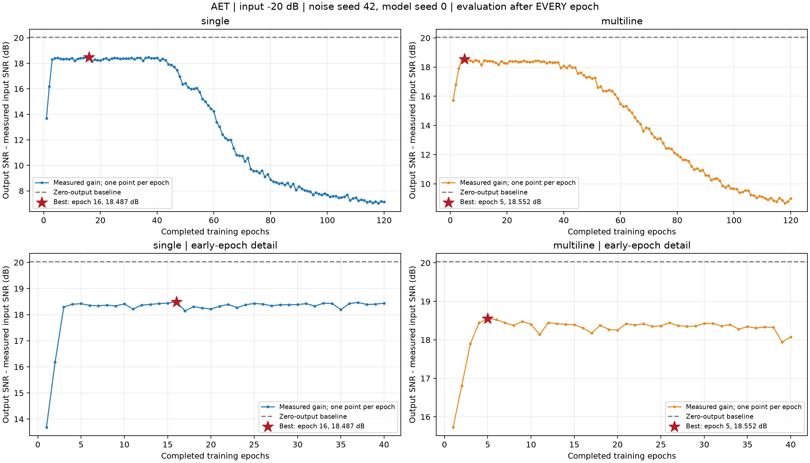
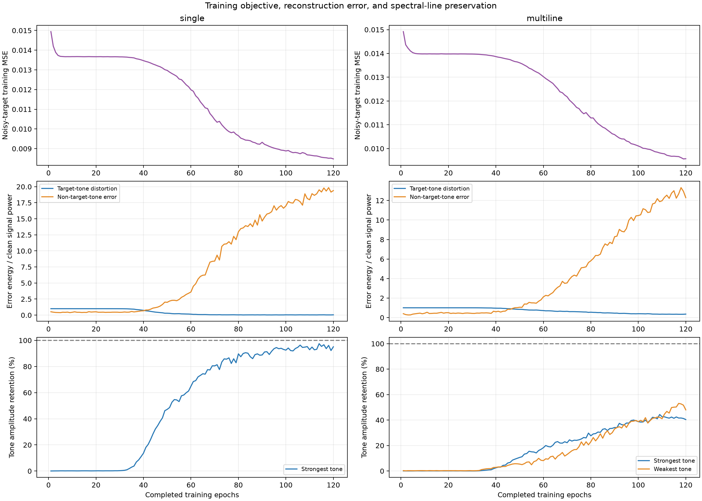

# AET 逐轮 SNR 增益实验与最佳停止轮次

实验日期：2026-10-07（Asia/Shanghai）。

噪声 seed=42、模型初始化 seed=0，沿用此前观测和默认网络结构；输入请求 SNR=-20 dB。完整训练范围为第 1 至 120 轮，每轮评估一次，没有插值或平滑。

## 定义与可比性

- 主图中的 SNR 差值定义为：ΔSNR(epoch) = 输出 SNR(epoch) − 同一评价区间的带噪输入 SNR。CSV 另存相邻轮次增益变化。
- 信号长度 16,000 点、采样率 1 kHz，power-normalized。单谱线 100 Hz；多谱线 50/100/180 Hz、幅度 1/0.6/0.3。
- 评价区间与原三算法对比相同，即 [8000,14976)。整段输入 SNR 精确为 -20 dB；评价子区间实测 SNR 有轻微差异。
- 一次连续训练，在各轮结束后切换 eval 模式计算指标，再恢复 train 模式。优化器、数据洗牌、种子和网络与原训练函数一致。
- 已在 10/30/60/120 轮与上一轮独立训练的结果核对（若在本次范围内）；损失与输出 SNR 一致。
- CPU 线程数 2；Adam 学习率 0.001、batch=16、dropout=0；223 个高度重叠序列，每轮 14 次参数更新。

## 最佳轮次（按输出 SNR 最大）

| 场景 | 最佳轮次 | 实测输入 SNR | 输出 SNR | SNR 增益 | 最强/最弱线幅值保留 |
|---|---:|---:|---:|---:|---:|
| single | 16 | -20.0281 dB | -1.5409 dB | 18.4871 dB | 0.17% / 0.17% |
| multiline | 5 | -20.0302 dB | -1.4780 dB | 18.5522 dB | 0.04% / 0.22% |



## 原因与选择局限

- single：最大值出现在第 16 轮；距离最佳值不超过 0.1 dB 的轮次为 [4, 5, 10, 13, 14, 15, 16, 22, 25, 26, 31, 33, 34, 36, 37, 38, 39, 40]。该峰值是本观测、初始化、模型和搜索范围内的实测最大值。
- single：最佳时刻，谱线子空间误差/干净功率=1.00077，谱线外误差/干净功率=0.41634，输出功率/干净功率=0.42515。
- single：最佳输出 SNR 仍低于“输出全为零”的 0 dB 基线。这说明最大增益并不等价于足够好的波形恢复；弱信号场景下接近零的输出本身就能获得约 20 dB 的输入到输出 SNR 增益。
- single：最佳轮次最强谱线幅值保留低于 10%，因此这个 SNR 峰值主要体现抑制输出误差，不能称为成功恢复谱线的最佳模型。
- multiline：最大值出现在第 5 轮；距离最佳值不超过 0.1 dB 的轮次为 [5, 6, 9]。该峰值是本观测、初始化、模型和搜索范围内的实测最大值。
- multiline：最佳时刻，谱线子空间误差/干净功率=1.00173，谱线外误差/干净功率=0.35255，输出功率/干净功率=0.40368。
- multiline：最佳输出 SNR 仍低于“输出全为零”的 0 dB 基线。这说明最大增益并不等价于足够好的波形恢复；弱信号场景下接近零的输出本身就能获得约 20 dB 的输入到输出 SNR 增益。
- multiline：最佳轮次最强谱线幅值保留低于 10%，因此这个 SNR 峰值主要体现抑制输出误差，不能称为成功恢复谱线的最佳模型。

训练目标是带噪序列。随着训练推进，网络可以同时学到谱线和目标中的特定噪声；当谱线外误差的增加超过谱线恢复的收益时，输出 SNR 下降，即使训练 MSE 继续下降。误差分解与谱线保留曲线用于检查这个过程，不将所有谱线外误差都武断归为噪声复制。



这里使用已知干净参考在同一观测上选择峰值，属于合成数据的事后诊断，不是独立验证集上确定的早停策略。若要为真实数据选择轮次，应结合独立噪声/隔离验证和谱线保留要求；不能直接把一个种子的最大值当作所有数据的固定停止轮次。

## 交付与复跑

- `snr_gain_per_epoch.png/.svg`：完整曲线和前 40 轮细节，每轮一个数据点。
- `per_epoch_metrics.csv`、`single_per_epoch.csv`、`multiline_per_epoch.csv`：逐轮输出 SNR、增益、损失、误差分解及谱线保留。
- `*_per_epoch_signals.npz`：每轮完整预测和干净/带噪观测，支持重算。
- `*_best_checkpoint.pt`：按上述 SNR 标准选出的检查点，附完整配置和归一化参数。
- `summary.json`、`manifest.json`：峰值、来源文件哈希、配置和运行环境。

```powershell
.\.venv\Scripts\python.exe scripts/aet_epoch_sweep.py --epochs 120
```
